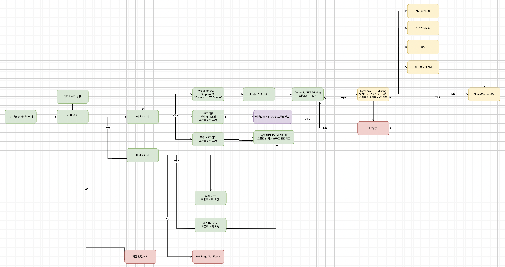

# 1. 팀 소개

- 팀명 : Team **LiFT**(**Live NFT**의 약어)
- 프로젝트명 : LiFT
- 프론트엔드 : 이의준(팀장)
- 백엔드 : 서학용
- 스마트 컨트랙트 : 김용현, 서학용, 이구범
- DevOps : 서학용
- PM : 전수린
- 노션 링크 : [BEB-08-LiFT](https://www.notion.so/5fee6980c9a34344a8c39186f40c455e)
- Github Repository : [BEB-08-LiFT](https://github.com/codestates-beb/BEB-08-LiFT)
- 배포링크 : [http://152.69.231.140:1323](http://localhost:1323/) (백엔드 서버)

# 2. 프로젝트 소개


# 3. What is Live NFT ?

- 살아있는 것처럼 생생한 NFT를 민팅히고 판매, 구매할 수 있는 NFT 플랫폼
  

# 4. What is Dynamic NFT?


동적 NFT(dynamic NFT)는 외부 조건에 따라 메타데이터를 자동으로 변경할 수 있는 NFT입니다.

- NFT는 “Non-Fungible Token”의 약자이며 블록체인 상의 고유한 디지털 자산으로 대체가 불가능한 불변한 토큰입니다. 각 NFT는 고유한 계약 주소와 토큰 ID를 가지고 있고 토큰의 메타데이터에 이미지, 파일, 데이터, 링크와 같은 정보를 넣을 수 있습니다. NFT는 명실상부 블록체인의 가장 눈에 띄는 애플리케이션 중 하나이자 가장 인기를 얻은 Dapp입니다. 메타버스와 예술 또는 부동산과 같은 분야에서 좋은 기회를 제공하며 발전하며 이미 많은 곳에서 사용합니다.

- 하지만 NFT가 발행되면 토큰 ID와 메타데이터가 영구적으로 변경을 하지못하는 정적(Static)인 특징을 가지고 있습니다. 이 특성은 NFT의 유용성에 대한 의문을 제기하게 만들었고 결국 NFT의 한계로 여겨지게 되었습니다. 이 한계를 뛰어넘기 위해 기존의 NFT를 넘어 다음 세대 NFT인 dNFT(Dynamic Non-Fungible Token)가 등장했습니다.

- 앞으로 등장할 동적 NFT는 현재의 NFT와는 다르게 한번 발행된 NFT의 속성, 즉 메타데이터가 변할 수 있는 NFT를 말합니다. 발행 또는 소유한 기간, 다른 NFT와의 결합이나 합체, 심지어는 오프체인 데이터(날씨, 환율, 주가, 유가 등)의 변화에 따라 속성이나 능력, 기능, 외관까지 모두 변하는 NFT를 설계할 수 있습니다.

# 5. LiFT 가 제공하는 가치

- Dynamic NFT Minting
  - 날씨 : 날씨에 따라 상태가 변하는 Dynamic NFT
  - 코인 : 코인시세에 따라 상태가 변하는 Dynamic NFT
  - 시간 : 시간과 계절에 따라 상태가 변하는 Dynamic NFT
  - 스포츠 : 스포츠 선수의 득점 및 데이터에 따라 상태가 변하는 Dynamic NFT
- 쉽게 Dynamic NFT를 사고 팔 수 있는 플랫폼 제공

# 6. 기획 및 개발 계획

- 글도 중요하지만 그림으로 전체 서비스를 그릴 줄 알아야 이해했다고 생각해서 기획 및 개발 중 만들었던 문서들입니다.

## **초기에 생각한 서비스 Flow**



## **최종적으로 구성한 서비스 Flow**


## **Weather DNFT Flow**


## 프론트엔드 To Do List

- https://github.com/codestates-beb/BEB-08-LiFT/issues/15

## 백엔드 To Do List

- https://github.com/codestates-beb/BEB-08-LiFT/issues/14

## 스마트 컨트랙트 To Do List

- https://github.com/codestates-beb/BEB-08-LiFT/issues/16

# 7. Backend API

## API 명세서

| API Name                                     | Method | API Path                             |
| -------------------------------------------- | ------ | ------------------------------------ |
| 메인 홈페이지                                | GET    | http://localhost:1323/               |
| NFT 디테일 페이지                            | GET    | http://localhost:1323/searchdetail/1 |
| 검색                                         | GET    | http://localhost:1323/search?        |
| 마이 페이지                                  | GET    | http://localhost:1323/user/mypage    |
| 마이 페이지 수정                             | POST   | http://localhost:1323/mypage/edit    |
| Chainlink Automation NFT Dynamic NFT Minting | POST   | http://localhost:1323/mnfts          |
| Weather Dynamic NFT Minting                  | POST   | http://localhost:1323/wdnfts         |
| 구매                                         | POST   | http://localhost:1323/buy            |
| 판매                                         | POST   | http://localhost:1323/sell           |
| 메타데이터 업데이트                          | POST   | http://localhost:1323/metadata       |

## Postman으로 request 요청시 백엔드 서버의 로그를 확인


# 8. DB Table

```
create database lift;

use lift;

CREATE TABLE `users` (
  `id` int PRIMARY KEY AUTO_INCREMENT ,
  `name` varchar(255),
  `owner_address` varchar(255),
  `description` varchar(255)
);
ALTER TABLE users ADD UNIQUE (`owner_address`);

CREATE TABLE `nft` (
  `id` int PRIMARY KEY AUTO_INCREMENT,
  `users_id` int default 0,
  `token_id` int default 0,
  `owner_address` varchar(255),
  `name` varchar(255),
  `description` varchar(255),
  `ipfs_url` varchar(255),
  `nft_contract_address` varchar(255)

);

CREATE TABLE `nft_metadata` (
  `id` int PRIMARY KEY AUTO_INCREMENT,
  `token_id` int default 0,
  `owner_address` varchar(255),
   `nft_contract_address` varchar(255),
  `ipfs_url1` varchar(255),
  `ipfs_url2` varchar(255),
  `ipfs_url3` varchar(255),
  `ipfs_url4` varchar(255)
);

CREATE TABLE market (
   `id` int PRIMARY KEY AUTO_INCREMENT,
   `nft_contract_address` varchar(255),
   `market_contract_address` varchar(255),
   `token_id` varchar(255),
   `owner_address` varchar(255),
   `price` int ,
   `sale_status` varchar(255)
);

CREATE TABLE `automation_dnft` (
  `auto_id` int PRIMARY KEY AUTO_INCREMENT,
  `auto_users_id` int,
  `auto_token_id` int,
  `auto_owner_address` varchar(255),
  `auto_name` varchar(255),
  `auto_description` varchar(255),
  `auto_ipfs_url` varchar(255),
  `auto_nft_contract_address` varchar(255)
);

CREATE TABLE `Weather` (
`id` int PRIMARY KEY AUTO_INCREMENT,
`locationID` int,
`name` varchar(255),
`latitude` float,
`longitude` float,
);

CREATE INDEX idx_nft_name ON nft(name);
CREATE INDEX idx_nft_description ON nft(description);
CREATE INDEX idx_nft_ownerAddress ON nft(owner_address);

```

# 9. env 구성

## 9-1. 기본설정

- ADRESS=""
- NETWORK="mumbai"
- PRIVATEKEY=""
- NFT_FOLDER=""
- HOST=localhost
- PORT=1323
- CONTRACTS=""

## 9-2 DB Config

- user=""
- password=""
- DB_DRIVER=""

## 9-3 Dynamic NFT Contract

- WEATHERFEED=""
- WEATHERNFT=""
- WEATHERUPKEEP=""

## 9-4 VRF 컨트랙트 주소

- VRFCONTARCT=""

## 10. Sample Hardhat Project
